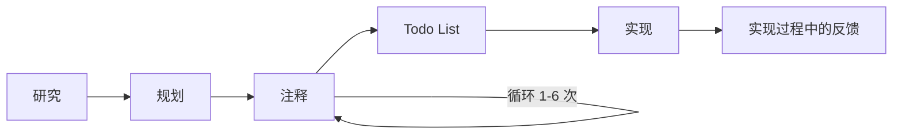
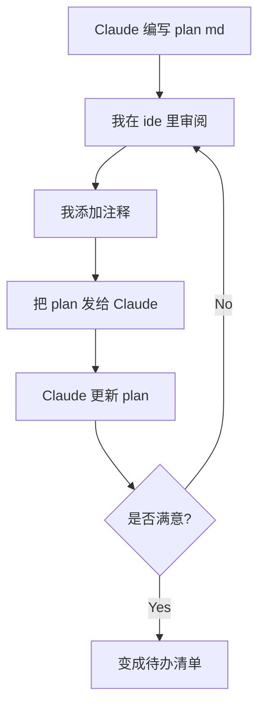
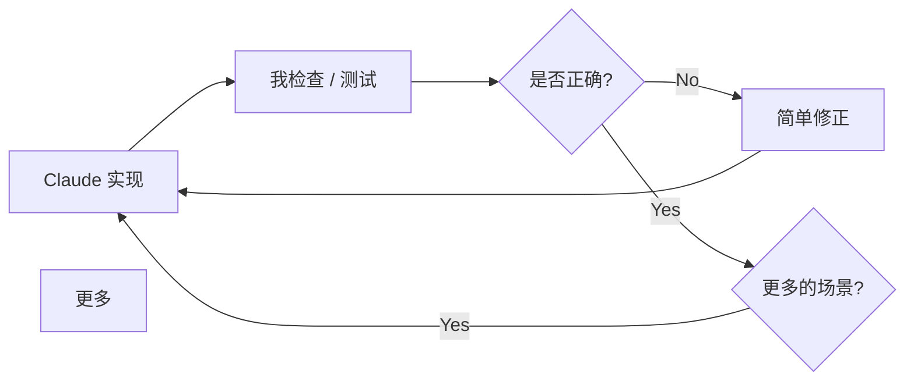

我用 [Claude Code](https://docs.anthropic.com/en/docs/claude-code) 当主力开发工具大概有 11 个月了，
我摸索出来的这套工作流跟大多数人用 AI 编程工具的方式完全不一样。

我看到的大部分人是怎么做的呢？
打一段提示词，有时候用用计划模式，然后修报错，再重复。
那些"重度网上冲浪"的开发者呢，
他们在搞什么 `ralph loops`、`mcp`、`gas towns` 「还记得这玩意儿吗？」之类的组合拳。
但不管是哪种方式，结果都是一团糟，遇到稍微复杂点的任务就崩了。

我要介绍的这套工作流有一个核心原则：
**在 Claude 写代码之前，你必须先审阅并批准一份书面计划**。
把规划和执行分开来做，这是我最最重要的一招。
它能避免浪费时间、让我牢牢掌控架构决策，
而且相比直接跳到写代码，用更少的 token 就能产出更好的结果。

:br



:br

---

## 第一阶段：研究

每一个有意义的任务都从 "深度阅读" 指令开始。
我会让 Claude 先把代码库的相关部分彻底搞清楚，然后再干别的。
而且我总会要求它把研究发现写进一个持久的 MarkDown 文件里，
而不是只在聊天窗口里口头总结一下。

> 请深入阅读此文件夹，透彻理解其运作方式、功能及其所有细节。
> 完成后，请在 `.research/Init.md` 文件中撰写一份详细的学习和发现报告。

> 深入研究通知系统，了解其复杂机制，
> 并撰写一份详尽的 `.research/Notification.md` 文档，
> 涵盖关于通知工作原理的所有知识点。

> 仔细检查任务调度流程，深入理解并查​​找潜在的错误。
> 系统中肯定存在错误，因为它有时会运行一些本应取消的任务。
> 持续研究流程，直到找到所有错误为止，不要停止。
> 完成后，在 `.research/[bug name].md` 文件中撰写一份详细的发现报告。

注意措辞：**"深入"**、**"详尽"**、**"潜在"**、**"全部过一遍"**。
这可不是什么废话。没有这些词，
Claude 就会草草浏览 —— 随便读一个文件，看看函数签名层面是干嘛的，就跳过去了。
你得让它明白，只做表面功夫是不行的。

一个书面产物「`.research/Init.md`」非常关键。
这不是为了让 Claude 做作业。这是我的审查界面。
我可以读它，验证 Claude 是不是真的理解了这个系统，在还没开始规划之前就纠正它的误解。
如果研究阶段错了，计划就会错，实现也会错。垃圾进，垃圾出。

这是 Vibe Coding 里最可怕的失败模式，而且这并不是语法错误或逻辑错误。
而是那些单独看能跑、但会破坏周边系统的实现。比如

- 一个函数无视了现有的缓存层；
- 一个迁移没考虑 ORM 的约定；
- 一个 API 端点重复了别处已经存在的逻辑。

研究阶段能防止所有这些。

---

## 第二阶段：规划

研究完成后，我要求 Claude 写一份详细的实现计划，
同样要写到 MarkDown 文件里（通常是 `.plan/[plan name].md`）。

> 我想开发一个新功能`<name and description>`这使得系统能够执行`<business outcome>`编写一份详细的 `.plan/[feat name].md` 文档，
> 概述如何实施该计划，并包含代码片段。

这份计划包括：

- **要修改的文件**，以及每个文件要改什么
- **要创建的函数/组件**，包括它们的签名
- **数据库变更**（迁移、新表、索引）
- **API 变更**（新端点、修改的端点）
- **测试策略**（要测试什么、怎么测）
- **潜在风险**（需要注意的地方）

关键是这份计划要**详细到可以直接照着实现**。
不是那种"然后我们会添加通知功能"这种模糊的描述。
而是"在 `src/notifications/email.ts` 里创建一个 `sendEmail` 函数，
参数是 `to: string`、`subject: string`、`body: string`，
用现有的 `transporter` 配置……"

我经常使用自己的 `.plan/[plan name].md` 计划文件，而不是 Claude Code 内置的 Plan 模式。
内置的 Plan 模式太难用了。
我的 Markdown 文件让我拥有完全的控制权。
可以在 IDE 里修改它，添加注释，同时它会成为项目中的一部分保存下来。

**一个常用技巧**：对于那些边界清晰的功能，如果我在某个开源仓库里看到过优秀的实现，
我会把那段代码作为参考一并分享给我的计划。
比如我想添加可排序 ID 时，我会从做得好的项目里粘贴那段代码，
然后说："他们是这样做的，写一份 `.plan/[plan name].md` 解释一下我们可以如何采用类似的方法。"
当 Claude 有具体的参考实现可以借鉴，而不是从零开始设计时，它的表现会好得多。

但编写 plan MarkDown 本身并不是最有趣的部分。接下来发生的事才是。

### 注释循环

这是我工作流里最独特的地方，也是我觉得自己最发挥价值的环节。

:br



:br

Claude 写完计划后，我在 IDE 里打开它，**直接在文档里添加注释**。
这些注释用来纠正假设、拒绝某些做法、添加约束条件，
或者提供 Claude 不具备的领域知识。

注释的长度差别很大。有时候就两个字：
在它标记为可选的参数旁边写个"not optional"。有
时候是一段话，解释业务约束，
或者贴一段代码片段展示我期望的数据格式。

我加过的一些真实注释例子：

- *"迁移用 drizzle\:generate ，别用原始 SQL"* —— Claude 不知道的领域知识
- *"不对 —— 这个应该是 PATCH ，不是 PUT"* —— 纠正错误的假设
- *"整段删掉，这里不需要缓存"* —— 拒绝提议的做法
- *"队列消费者已经处理重试了，所以这个重试逻辑是多余的。删掉它，直接让它失败就行"* —— 解释为什么要改
- *"这不对， visibility 字段应该在列表本身上，而不是在单个项目上。列表是公开的时候，所有项目都是公开的。相应地重新组织 schema 部分"* —— 重定向计划的整个部分

然后我让 Claude 回到文档：

> 我给文档加了几个注释，处理所有注释并相应更新文档。**先别实现** 。

**这个循环重复 1 到 6 次。** 明确的 **"先别实现"** 这个护栏至关重要。
没有它， Claude 一觉得计划够好了就会跳到写代码。只有我说够了才算过关。

### 为什么这样做有奇效

MarkDown 文件充当我和 Claude 之间的**共享状态**。
我可以按自己的节奏思考，精确地标注哪里错了，
然后重新投入而不会丢失上下文。
我不是试图在聊天消息里解释所有东西。我是在文档里确切的问题位置指出来，
直接在那里写我的修正。

这跟试图通过聊天消息来引导实现是根本不同的。
Plan 是一个结构化的、完整的规范，我可以整体审阅。
聊天记录是我得滚动着去重建决策的东西。计划每次都赢。

"我添加了注释，更新计划"可以把一个通用的实现计划变成完美契合现有系统的计划。
Claude 很擅长理解代码、提出解决方案、写实现。
但它不知道我的产品优先级、我的用户痛点、我愿意做的工程权衡。
[注释循环](#%E6%B3%A8%E9%87%8A%E5%BE%AA%E7%8E%AF)就是我注入这些判断的方式。

### 待办清单

计划定稿后，我让 Claude 把它拆成一份待办清单：

> 把 `.plan/[plan name].md` 转换成一份结构化的待办清单，
> 每个任务都要足够小，可以一步完成 —— 暂时不要写代码。

这份清单通常长这样：

```md
- [ ] 1. 创建数据库迁移，添加 notifications 表
- [ ] 2. 运行迁移
- [ ] 3. 创建 Notification 类型定义
- [ ] 4. 实现 createNotification 函数
- [ ] 5. 实现 sendNotification 函数
- [ ] 6. 添加通知 API 端点
- [ ] 7. 创建通知 UI 组件
- [ ] 8. 把通知组件集成到主布局中
- [ ] 9. 添加测试
```

这让进度可以追踪。我可以清楚地看到完成了什么、还剩什么。而且这能防止 Claude 一次做太多事情。

---

## 第三阶段：实现

现在，终于，我开始让 Claude 写代码了，
在与 Claude 长时间的配合中，我已经创造出了一套标准的提示词：

> 全部执行完毕。完成一项任务或阶段后，在计划文档中将其标记为已完成。
> 务必在所有任务和阶段完成之前保持工作。
> 不要添加不必要的注释或 JSDoc ，不要使用任何未知类型。
> 持续运行类型检查，确保不会引入新的问题。

这一条提示包含了所有重要的信息：

- **“全部执行”** ：按照计划完成所有事项，不要挑挑拣拣。
- **“在计划文件中将其标记为已完成”** ：计划是进度的真实来源。
- **“在所有任务和阶段完成之前不要停止”** ：不要在流程中途停下来确认。
- **“不要添加不必要的注释或 jsdoc”** ：保持代码简洁
- **“请勿使用任何未知类型”** ：保持严格的类型控制
- **“持续运行类型检查”** ：及早发现问题，而不是等到最后。

我几乎在每次都会使用完全相似的提示词。
当我输入“全部执行”时，所有决策都已经做出并验证完毕。
实施过程变得机械，而非具有创意。当然这是我刻意而为之的。
我希望 Claude 编写代码的时候是枯燥且乏味。
创造性的工作是在标注阶段完成的。
一旦计划正确，执行就应该顺畅无阻。

如果没有规划阶段，通常的情况是，
Claude 会在早期做出一个看似合理但却错误的假设，
然后在此基础上进行 15 分钟的开发，之后我不得不撤销一系列更改。
“暂时不要写代码”的规则可以完全避免这种情况。

### 实现过程中的反馈

一旦 Claude 在执行计划，我的角色就从*架构师*变成了*监督者*。
我的提示词变得简短得多。

:br



:br

规划阶段的注释可能是一段话，实现阶段的修正往往就一句话：

- "你没实现 `deduplicateByTitle` 函数。"
- "你把设置页面建在主应用里了，但应该在 admin 应用里，把它挪过去。"

Claude 有计划的完整上下文和正在进行的会话，所以简短的修正就够了。

前端是最需要迭代的。我在浏览器里测试，然后快速发修正：

- "再宽点"
- "还是被截断了"
- "有个 2px 的缝隙"

对于视觉问题，我有时候会附截图。一张表格没对齐的截图比描述问题快得多。

我也经常引用现有代码：

- "这个表格应该看起来跟用户表格一模一样，同样的表头、同样的分页、同样的行密度。"

这可比从头描述一个设计要精确得多。
成熟代码库里的功能大多是现有模式的变体。
新的设置页面应该看起来像现有的设置页面。
指向参考对象就能传达所有隐含需求，不用一一说明。
Claude 通常会在做修正之前先读参考文件。

当某个东西方向错了，我不会试图修补它。我回滚然后重新定范围，把 git 改动丢弃：

- "我把所有东西都回滚了。现在我只想把列表视图做得更简洁 —— 别的都不要。"

回滚后缩小范围，几乎总是比试图渐进式修复一个错误的做法能产生更好的结果。

### 保持主导权

尽管我把实现托付给了 Claude, **但我从不给它完全的自主权来决定要做什么** 。
我在 `.plan/[plan name].md` 文档里完成了绝大部分的主动引导。

这很重要，因为 Claude 有时候会提出技术上正确但对项目来说错误的解决方案。
可能这个做法过度工程化了，或者它改了系统其他部分依赖的公共 API 签名，
或者它在有更简单的选择时挑了个更复杂的。
我有 Claude 没有的关于更广泛系统、产品方向和工程文化的上下文。

**从提议里挑挑拣拣：** Claude 发现多个问题时，
我一个一个过：*"第一个，直接用 &#x60;Promise.all`**&#x20;，别搞太复杂；第三个，抽成一个单独的函数提高可读性；第四第五个忽略，不值得这么复杂。"*
我根据对当下什么重要的了解来做逐项决策。

**修剪范围：** 当计划里包含锦上添花的东西时，我会主动砍掉。
*"把下载功能从计划里删掉，我现在不想实现这个。"*
这能防止范围蔓延。

**保护现有接口：** 当我知道有些东西不该改时，我会设定硬性约束：
*"这三个函数的签名不应该变，调用方应该去适配，而不是库去适配。"*

**推翻技术选择：** 有时候我有 Claude 不会知道的特定偏好：
*"用这个模型而不是那个"* 或者 *"用这个库的内置方法，别自己写一个。"*
快速、直接的推翻。

Claude 处理死板的实现，而我做判断决策。
在规划阶段提前捕获重大决策，
选择性引导处理实现过程中出现的小决策。

### 单次长会话

我通常在一个会话里完成整个工作流。
`研究`、`规划`、`注释`、`实现` —— 都在一个持续的 Claude Code 会话里完成。

我没有遇到大家说的 50% 上下文窗口之后性能下降的问题。
实际上，当我终于说"全部实现"的时候，
Claude 已经在整个会话里花时间建立理解了：
研究阶段读文件、注释期间完善它的心智模型、吸收我的知识修复错误的规划。

当上下文窗口填满时，
Claude 的自动压缩会保留足够的上下文继续。
而且规划的文档这个持久产物会被完整的保留在上下文中。
我随时可以指给它看。

## 总结

深度研究，写计划，注释直到完全满意，
然后让 Claude 一口气全部执行，期间检查类型。

就这些。没有什么神奇的提示词，没有复杂的系统指令，没有巧妙的花招。
只是一条有纪律的流水线，把思考和打字分开。
防止 Claude 做无知的改动。计划防止它做错误的改动。
通过注释共享我的判断。
让它在所有决策做出后不间断地实现。

尝试一下我的工作流程，你大概率会感叹以前没有带注释的计划文档挡在你和代码之间，你是如何通过编码代理发布任何东西的。
